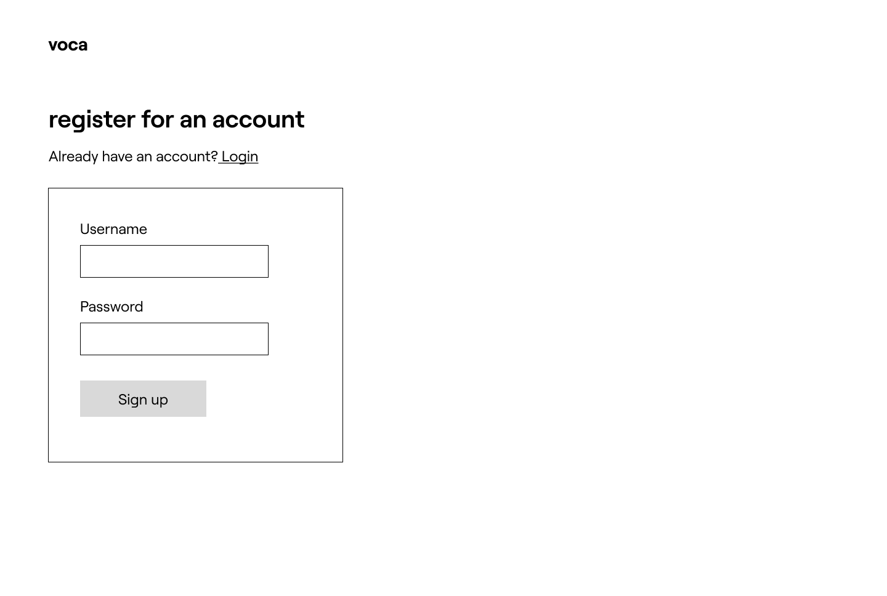
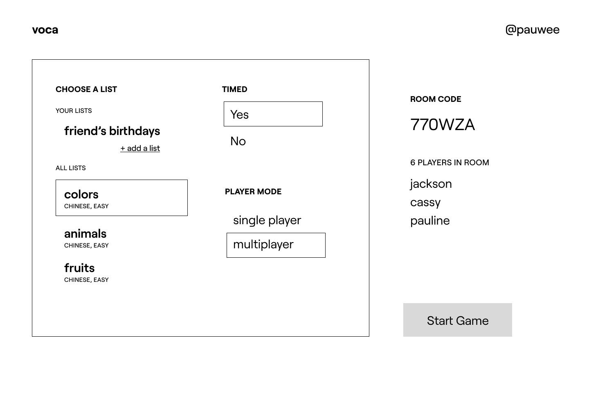
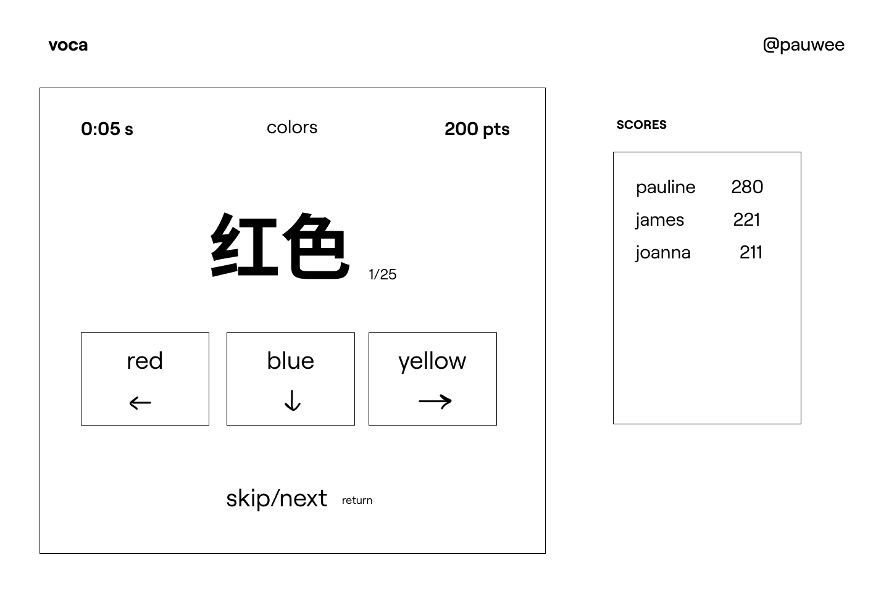

# Voca

Learning and practicing vocabulary (especially for complex languages like Chinese or Arabic) is way too boring and difficult. It gets especially tiring doing it alone. Voca gamifies your vocabulary practice by yourself or with friends, with any list of your choice!

Users can register, log in, upload or delete lists of vocabulary. They can choose to play as either singleplayer or multiplayer, or with or without time as a factor. They can also view leaderboards and high scores for each vocabulary list so tha

## Data Model

The application will store Users and Lists of Vocabulary with leaderboards and items

* users can have multiple lists (via references)
* each list can have multiple items (by embedding) and a leaderboard of top 5 user high scores

An Example User:

```javascript
{
  username: "paulinewee",
  hash: // a password hash,
  lists: // an array of references to List documents
  color: //color preference for customization
  theme: //theme preference for customization
}
```

An Example List with Items:

```javascript
{
  id: 1234
  language: "Chinese"
  name: "Colors",
  played: 10 //counts how many times played in one session
  difficulty: "Easy",
  items: [
    { name: "红色", def:"red"},
    { name: "蓝色", def:"blue"},
  ],
  scores: [
    { user: "pauline", score: 200},
    { user: "joanna", score: 400},
  ],
}
```


## [Link to Commented First Draft Schema](db.mjs)

[Link to Commented First Draft Schema](db.mjs)

## Wireframes

(__TODO__: wireframes for all of the pages on your site; they can be as simple as photos of drawings or you can use a tool like Balsamiq, Omnigraffle, etc.)

/signup


/login



/profile


/home - modify slightly for singleplayer or multiplayer




/game - singleplayer game


/game/P1SD3A - multiplayer game using room code



/results - game results, scores etc updated in database


/add - add a list, input will be validated


## Site map

Voca sitemap


## User Stories or Use Cases

1. as non-registered user, I can register a new account with the site
2. as a user, I can log in to the site
3. as a user, I can create a new vocabulary list
4. as a user, I can remove a vocabulary list
5. as a user, I can change settings for a game (choice of list, single/multiplayer, time/no time)
6. as a user, I can play a singleplayer game
7. as a user, I can set up a multiplayer game that others can join
8. as a user, I can view and be on the leaderboard for a game
9. as a user, I can view my high scores on my profile
10. as a user, I can view and add lists on my profile
11. as a user, I can set my preferred color and theme for the page

## Research Topics

* (3 points) Perform client side form validation using custom JavaScript or JavaScript **library**

  * I will validate the input of the forms by checking if they're the correct language or comma-separated-value format
* (2 points) Use a CSS framework or UI toolkit, use a reasonable of customization of the framework (don't just use stock Bootstrap - minimally configure a theme):

  * I will use [tailwind.css](https://tailwindcss.com/) and design custom themes that the user can choose from
* (6 points) Use a front-end framework

  * I will most likely use [Next.js](https://nextjs.org/) as my frontend
  * If not, I will use either [React](https://reactjs.org/) or [Vue.js](https://vuejs.org/)
* (1 - 6 points) Use a **client-side** JavaScript library or module that we did not cover in class (not including any from other requirements)

  * I will use sockets to implement the multiplayer portion of the website
  * I might use Chart.js to plot user progress over time (similar to monkeytype or other game websites)
  * I want to make a version of the game where you can play using the p5.js ML Posenet (so that instead of clicking to make your choice, you wave your hand and your camera registers its position)
    * I've played around with this before and it might be doable, but I will see whether time permits for it to happen

  If any of the points listed above do not work out, I will substitute with:
* (5 points) Integrate user authentication

  * I'm going to be using passport for user authentication
  * And account has been made for testing; I'll email you the password
  * see `<code>`cs.nyu.edu/~jversoza/ait-final/register `</code>` for register page
  * see `<code>`cs.nyu.edu/~jversoza/ait-final/login `</code>` for login page

[Link to Initial Main Project File](app.mjs)

## Annotations / References Used

1. [passport.js authentication docs](http://passportjs.org/docs)
2. [next.js tutorial]()
3. [reference for p5.js ml5 posenet](https://editor.p5js.org/kylemcdonald/sketches/H1OoUd9h7)
